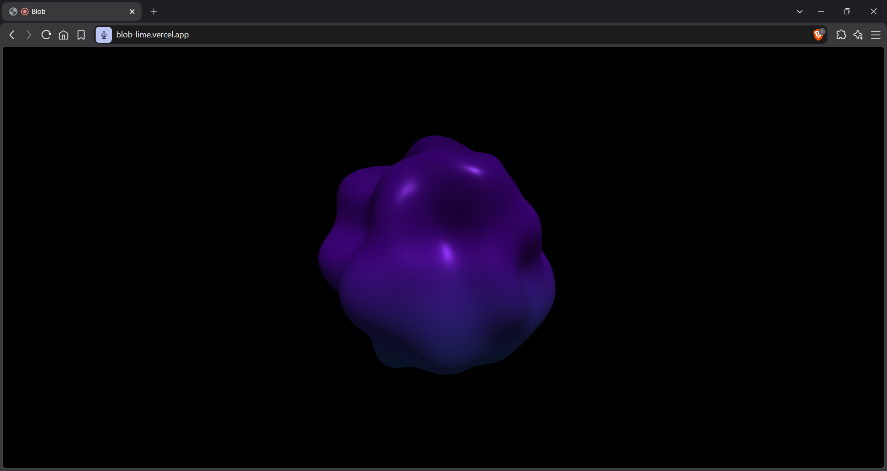

# Blob

A website where a clay-like sphere interacts with the sound of your microphone according to its intensity and also interacts with mouse.

I created this because it coume out in my mind in dream so i wake up and did this.

i wish u have fun of this

(hack note: try use it while playing a song in spotify, it 's funny)

## Tech used
- HTML
- CSS
- Javascript
- Threejs(library for javascipt)
- createNoise3D(library for javascipt)

<hr>

## How to run
use demo link it's web playable

It receives the sound and calculates the intensity of it through analyzer in `analyzer = ac.createAnalyser();` from this function
```
async function setup_audio(){
    try{
        const requestt = await navigator.mediaDevices.getUserMedia({audio:true});
        const ac = new (window.AudioContext || window.webkitAudioContext)();
        const soundsource = ac.createMediaStreamSource(requestt);
        analyzer = ac.createAnalyser();
        analyzer.fftSize = 64;
        soundsource.connect(analyzer);

        dataArray = new Uint8Array(analyzer.frequencyBinCount);
    }

    catch(err){
        console.warn("Microphone access denied:", err);
    }
}
```
it rates the intensity 64 time through the second fromm 1 to 0 and save it to a variable to pass it to this function
```
function update_blob(volume, mousepoint){
    const position_attribute = geometry.attributes.position;
    for(let i = 0; i < position_attribute.count; i++){
        const uX = originalPositions[i * 3];
        const uY = originalPositions[i * 3 + 1];
        const uZ = originalPositions[i * 3 + 2];

        const noise2 = noise(uX * 0.08, uY * 0.08, uZ * 0.08);
        let distortion = 1 + (noise2 * volume * 0.5);

        if(mousepoint && isMouseDown) {
            v.set(uX,uY,uZ);
            const distance = v.distanceTo(mousepoint);
            const falloutdistortion = Math.max(0, 1- distance / 8);
            distortion -= falloutdistortion * 0.6;
        }

        position_attribute.setXYZ(i, uX * distortion, uY * distortion, uZ * distortion);
    }

    position_attribute.needsUpdate = true;
    geometry.computeVertexNormals();
}
```
which make some calculations to make random bulges in random places in the blob when the mouse is clicked and the sound was received.

## DEMO link

[Blob](https://blob-lime.vercel.app/)

## AI Declaration

It was used only to explain how to make the the distortion function and the mouse tracking and its distortion cuz this was my first time to deal with `createNoise3D` and i was begginner at `Threejs` i was only know how to make a mesh and make an animation.
#### it was only used to explain not to write the whole code was written by hands and i understood first then wrote and didn't copy it manually from ai.

## Screenshots:



### Made by [Youssef Mohammed](https://github.com/youssefmoham655-dev)